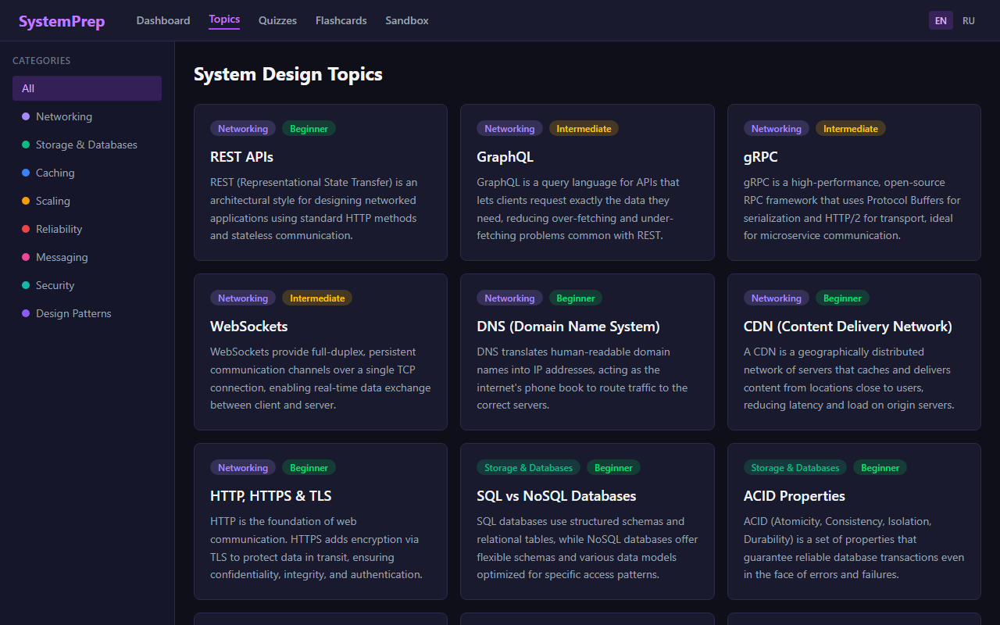
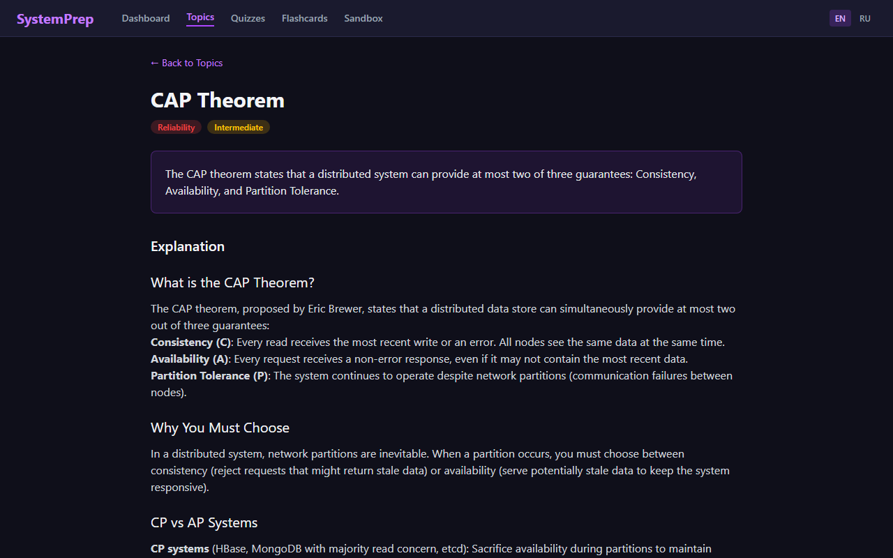
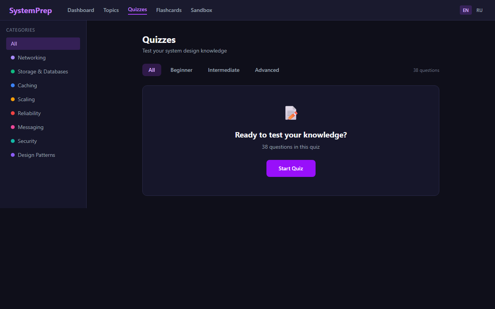
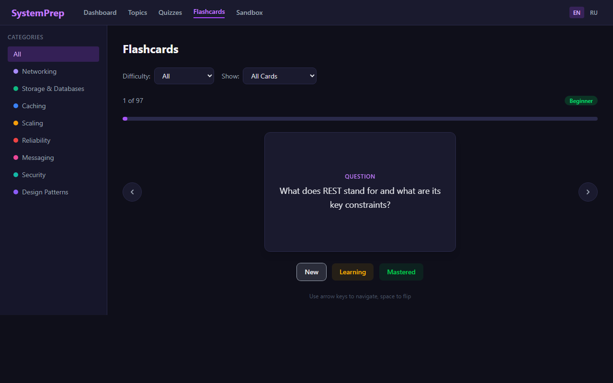
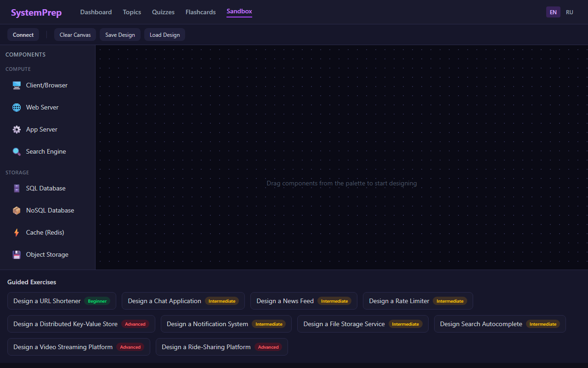
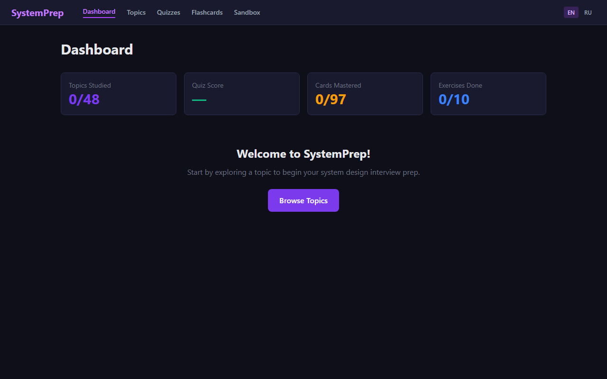

# SystemPrep — System Design Interview Prep

> Master system design concepts through interactive learning. 48 topics, quizzes, flashcards, and a drag-and-drop architecture sandbox — all in one place.

🌐 **English & Russian** · 📱 **Responsive** · 🔒 **No account needed** · 💾 **Progress saved locally**

---

## Preview

### 📚 Browse 48 Topics


### 📖 Deep-Dive into Any Concept


### 🧠 Test with Quizzes


### 🃏 Study with Flashcards


### 🏗️ Design Sandbox & Guided Exercises


### 📊 Track Your Progress


---

## Features

### Topics Browser
Browse 48 system design concepts organized into 8 categories: Networking, Storage & Databases, Caching, Scaling, Reliability, Messaging, Security, and Design Patterns. Each topic includes detailed explanations, key points, real-world examples, and interview tips.

### Quizzes
Test your knowledge with 35+ questions across multiple formats:
- **Multiple choice** — Pick the correct answer from 4 options
- **True/False** — Evaluate statements about system design concepts
- **Matching** — Match concepts to their definitions

Filter by category and difficulty. Scores are tracked and your best results are saved.

### Flashcards
Study with flip cards featuring spaced-repetition-style mastery tracking. Mark cards as New, Learning, or Mastered. Filter by category, difficulty, or mastery status. Keyboard shortcuts supported (arrow keys to navigate, space to flip).

### Design Sandbox
Two modes for hands-on practice:
- **Free-form canvas** — Drag system components (Load Balancer, Cache, Database, Message Queue, etc.) onto a canvas and connect them with labeled arrows to design architectures
- **Guided exercises** — 10 step-by-step design challenges (URL Shortener, Chat App, News Feed, Rate Limiter, and more) with hints and explanations

### Dashboard
Track your progress across all learning modes with stats for topics studied, quiz scores, cards mastered, and exercises completed.

## Tech Stack

| Tool | Purpose |
|------|---------|
| [Vite](https://vite.dev/) | Build tool & dev server |
| [React 18](https://react.dev/) | UI framework |
| [TypeScript](https://www.typescriptlang.org/) | Type safety |
| [React Router v6](https://reactrouter.com/) | Client-side routing |
| [Tailwind CSS v4](https://tailwindcss.com/) | Styling |
| [dnd-kit](https://dndkit.com/) | Drag-and-drop |
| [react-markdown](https://github.com/remarkjs/react-markdown) | Markdown rendering |
| [Vitest](https://vitest.dev/) | Testing |

## Getting Started

### Prerequisites

- Node.js 18+
- npm

### Installation

```bash
git clone https://github.com/Y1-Bit/Learn-System-Design.git
cd Learn-System-Design
npm install
```

### Development

```bash
npm run dev
```

Open [http://localhost:5173](http://localhost:5173) in your browser.

### Build

```bash
npm run build
```

Output is in the `dist/` folder — deploy as a static site to Vercel, Netlify, or GitHub Pages.

### Tests

```bash
npm test
```

## Topics Covered

| Category | Topics |
|----------|--------|
| Networking | REST API, GraphQL, gRPC, WebSockets, DNS, CDN, HTTP/HTTPS & TLS |
| Storage & Databases | SQL vs NoSQL, ACID, Indexing, Replication, Sharding, LSM Trees, Object Storage |
| Caching | Strategies, Invalidation, Redis/Memcached, CDN Caching, Eviction Policies |
| Scaling | Horizontal/Vertical, Load Balancing, Auto-scaling, Partitioning, Read Replicas, Connection Pooling |
| Reliability | CAP Theorem, Failover, Circuit Breaker, Health Checks, Redundancy, Disaster Recovery |
| Messaging | Message Queues, Pub/Sub, Kafka, Event Sourcing, CQRS |
| Security | OAuth/JWT, RBAC, Rate Limiting, Encryption, API Security |
| Design Patterns | Microservices, API Gateway, Saga, Bloom Filters, Leader Election, Consistent Hashing, Gossip Protocol |

## Guided Exercises

1. Design a URL Shortener
2. Design a Chat Application
3. Design a News Feed
4. Design a Rate Limiter
5. Design a Distributed Key-Value Store
6. Design a Notification System
7. Design a File Storage Service
8. Design Search Autocomplete
9. Design a Video Streaming Platform
10. Design a Ride-Sharing Platform

## Data Persistence

All progress is stored in your browser's localStorage. No account needed, no data sent to any server.

## Contributing

Contributions are welcome! See [CONTRIBUTING.md](CONTRIBUTING.md) for guidelines.

## License

[MIT](LICENSE)
